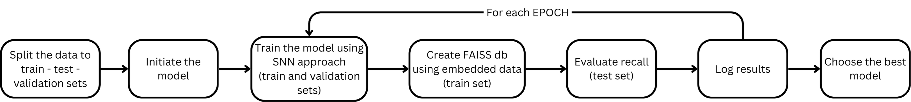

To evaluate the solution performance we used the workflow below:

    
    
Evaluation workflow

All used model architectures and data division approaches are described [here](../models/README.md)

All experiments represented by groups:
1. **SNN for pairs**

    1.1 Contrastive loss based on Euclidean distance

    1.2 Contrastive loss based on Cosine distance

2. **SNN for triplets**

    2.1 [3 fully connected layers with ReLU, all data, best result](SNN_T_Full)

3. **Mixed**

- [Different model architectures tested on 100 users](evaluation/model_expleriments.ipynb)