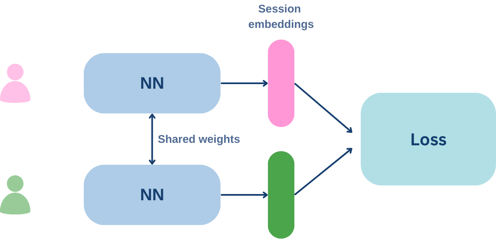
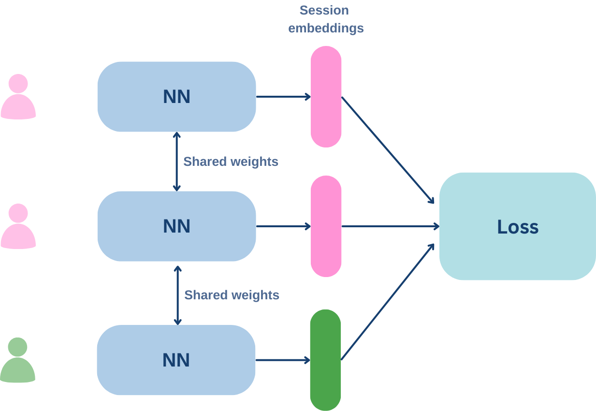
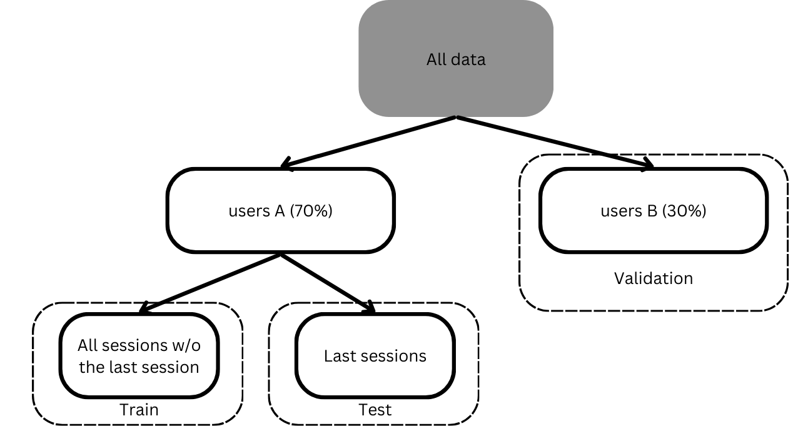
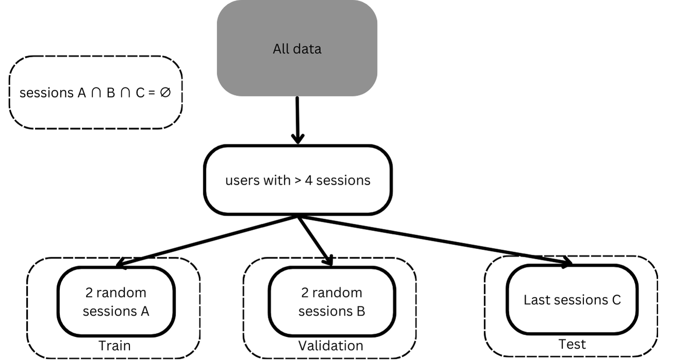

We leveraged the Siamese Neural Network (SNN) approach to generate embeddings.

### Used Siamese Neural Network (SNN) architechtures

While training the model we tried SNN for pairs and for triplets. 

1. SNN for pairs:

    
    
SNN architecture for pairs

Used losses for training:
Contrastive loss based on Euclidean distance:

L =  y * D² + (1 - y) * max(0, m — D)²

D = Euclidean distance

CODE: SNN-PD

Contrastive loss based on Cosine Similarity

L = y * CD² + (1 - y) * max(0, m — CD)²

CD = 1 - cosine_similarity

CODE: SNN-PCD

m - margin
y = 1 for similar pairs
y = 0 for dissimilar pairs
SNN for triplets:

2. SNN for triplets:

    
    
SNN architecture for triplets

Here we used Triplet Margin Loss:
L(a, p, n) = max{d(ai, pi) - d(ai, ni) + m, 0}

a - anchor session
p - positive example - a session from the similar user
n - negative example - a session from the different user

m - margin
d - Euclidean distance

### Used model architectures

1. TabNet

2. 3 fully connected layers with ReLU

3. 3 fully connected layers with Sigmoid

4. 4 fully connected layers

### Used data division approaches
1st

    
    
Data division by users

2nd

    
    
Train, test and validation sets contain sessions from the same users

 

